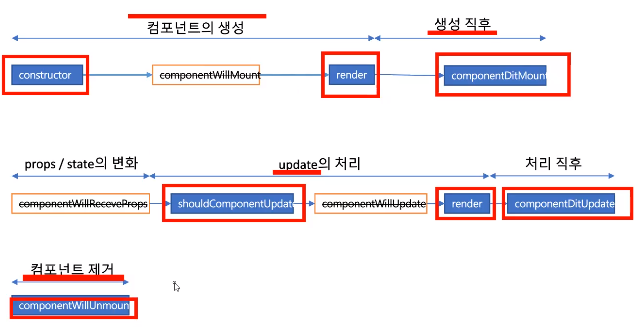

# 최재학 202030432
## [11월 17일]
> TodoList, 
### TodoList
- TodoApp과 TodoList 두 개의 컴포넌트로 구성
- handleChange는 모든 키보드 입력마다 React의 state를 갱신해서 보여준다.
- 시간순으로 보면 다음과 같이 동작한다.
- 유저입력 > handleChange > React의 state 갱신 > form element가 React state를 참조
- 유저 입력을 강제로 대문자로 변경할 경우에도 사용
```js
handleChange(event) {
  this.setState({value: event.target.value.toUpperCase()})
}
```
<br>
- render()메소드에서 초기 렌더링을 실행한다.
- onChange를 통해 input에 입력되는 값으로 state 상태 변경을 준비한다.
- 입력된 값은 state "text: " "에 임시로 저장된다.
- lavel의 htmlFor은 input과의 연결을 위한 id값이다.
- className처럼 html
- 버튼을 클릭하면 버튼의 숫자를 증가시킨다.
- 리스트는 배열로 저장되기 때문에 item.length를 통해 list의 수를 확인한다.
- input area에 이벤트가 발생하면 handleChange(e)가 동작하여 State의 text값을 변경한다.
- "Add #x"버튼을 클릭하면 리스트의 length에 1을 더해서 버튼에 출력한다.

### key props의 역할
- key는 props의 안정적으로 사용할 수 있도록 고유성을 부여하기 위해 필요
- React가 어떤 props를 변경, 추가 또는 삭제할 지 식별하는 것을 도와준다.
- 반드시 date를 사용하지 않아도 된다. 배열의 inedex값
- 유일한 값이라면 그 값이 무엇이든 상관없다.

### handleSubmit(e)에서 preventDefault()를 사용하는 이유
- Refresh를 막기 위해서

### 외부 플러그인을 사용하는 컴포넌트
- 외부 플러그인은 Remarkable을 사용함으로 CDN으로 링크를 추가한다.
- remarkable.js로 검색해야 찾을 수 있다.
## [11월 10일]
> 깃허브 배포하기
### package.json 수정
```js
"scripts": {
    "start": "react-scripts start",
    "build": "react-scripts build",
    "predeploy": "npm run build",
    "deploy": "gh-pages -d build"
  },
  (생략...)
  "browserslist": {
    "production": [
      ">0.2%",
      "not dead",
      "not op_mini all"
    ],
    "development": [
      "last 1 chrome version",
      "last 1 firefox version",
      "last 1 safari version"
    ]
  },
  "homepage": "https:cms893811.github.io/movie_app_2021"
}
```

- gh-pages 설치: npm install gh-pages
- 깃 허브 저장소 확인: git remote -v
- 배포: npm run deploy
<br>

### CDN
- CDN: Content Delivery Network 또는 Content Distiribution Network
- CORS: 특정 헤더를 통해서 브라우저에게 원 출처(origin)에서 실행되고 있는 웹 애플리케이션이 다른 출처(cross-origin)에 원하는 리소스에 접근할 수 있는 권한이 있는지 없는지를 알려주는 메커니즘
- Babel: ECMAScript 2015 + 코드를 이전 JavaScript 엔진에서 실행할 수 있는 이전 버전과 호환되는 JavaScript 버전으로 변환하는 데 주로 사용되는 무료 오픈 소스 JavaScript 트랜스 컴파일러

### 
<br>

## [11월 03일]
> 
### package.json과 package-lock.json 차이
- package.json은 패키지 의존성 관리 파일
- 협업을 할 때는 팀원들 각자의 컴퓨터에 같은 패키지들을 설치해서 동일한 개발환경을 구성해야 하는게 이때 사용하는 것이 package.json
- package.json의 경우 version range를 사용한다.
- package-lock.json은 package.json이 변경될 때 마다 업데이트 되는 것으로 좀 더 정확한 버전이 기록되어 있다.
- package.json과 package-lock.json이 충돌이 생길 경우, 보통 node 모듈을 지우고 다시 설치 시 대부분은 해결이 되지만 모듈이 설치가 안되거나
  설치되도 같은 오류가 생길 경우 package.json과 package-lock.jso을 삭제하고 다시 모듈을 설치하면 해결된다.

### Markdown Tip
- npm cache clean --force
- npm rebulid
- rm -f node_modules
- npm install
- 원인 모를 문제가 발생했을 때 cache clean과 rebuild를 통해 많은 부분을 해결할 수 있다.

### 네비게이션 만들어보기
- Navigation 컴포넌트 생성
- App 컴포넌트에 Navigation 컴포넌트 포함
```js
function Navigation() {
  return (
    <div>
      <a href="/">Home</a>
      <a href="/about">About</a>
    </div>
  );
}

export default Navigation;
```

- 현재는 a태그의 href 속성의 새로고침되는 특징 때문에 리액트의 장점이 없음. 이 문제를 해결하기 위해 react-router-dom의 Link 컴포넌트를 사용하면 됨.
<br>

### Link 컴포넌트
```js
import { Link } from 'react-router-dom';

function Navigation() {
  return (
    <div>
      <Link to="/">Home</Link>
      <Link to="/about">About</Link>
    </div>
  );
}

export default Navigation;
```
<br>

### 영화 상세 정보 기능
- route props : 라우팅 대상이 되는 컴포넌트에 넘겨주는 기본 props
- consol.log를 통해 About으로 어떤 props가 넘어오는지 확인
- react-router-dom에서 Route 컴포넌트가 그려줄 컴포넌트에 전달한 props를 확인할 수 있음
- route props에 데이터를 담아 보내려면 Navigation 컴포넌트에 있는 Link 컴포넌트의 to props 구조를 변경해야 함
- pathname은 URL을 의미, state는 route props에 보내줄 데이터를 의미
- Movie 컴포넌트에 Link 컴포넌트 추가
```js
import PropTyes from 'prop-types'
import "./Movie.css"
import { Link } from 'react-router-dom';

function Movie({title,year,summary,poster, genres}){
    return (
        <div className="movie">
            <Link to={{
                pathname: 'movie-detail',
                state: {year, title, summary, poster, genres}
            }}>
                
                <div className="movie-data">
                    <h3 className="movie-title">{title}</h3>
                    <h5 className="movie-year">{year}</h5>
                    <ul className="moive-geners">
                        {genres.map((genre, index) => {
                            return (
                                <li key={index} className="movie-genre">{genre}</li>
                            )
                        })}
                    </ul>
                    <p className="movie-summary">{summary.slice(0, 180)}...</p>
                </div>
            </Link>
        </div>
    )
}

Movie.PropTyes = {
    year: PropTyes.string.isRequired,
    title: PropTyes.string.isRequired,
    summary: PropTyes.string.isRequired,
    poster: PropTyes.string.isRequired,
    genres: PropTyes.arrayOf(PropTyes.string).isRequired
}

export default Movie;
```
- detail 컴포넌트 생성
```js
function Detail(props) {
  console.log(props);
  return <span>hello</span>;
}

export default Detail;
```
<br>

- Route 컴포넌트 추가

### 리다이렉트 기능 만들기
- Detail 컴포넌트 클래스형 컴포넌트로 변경 - componentDidMount() 함수를 사용해 Detail 컴포넌트가 마운트될 때 push() 함수를 사용하기 위해
- push() : 지정한 URL로 보내줌
```js
import React from "react";

class Detail extends React.Component {
  componentDidMount() {
    const {location, history} = this.props;
    if(location.state === undefined){
      history.push('/');
    }
  }

  render() {
    return (
      <span>hello</span>
    );
  }
}

export default Detail;
```

### 영화 제목 출력하기
- location.state.title 출력
```
 render() {
    const {location} = this.props;
    return (
      <span>{location.state.title}</span>
    );
  }
```
- Detail 컴포넌트는 render() -> componenetDidMount() 순서로 실행하기 때문에 작동하지 않음, render() 함수에도 componenetDidMount()에 작성한 리다이렉트 코드를
추가하면 됨
```js
render() {
  const {location} = this.props;
  if(location.state) {
    return (
      <span>{location.state.title}</span>
    );
  } else {
    return null;
  }
}
```
- 새로고침 또는 주소 입력 시 render()는 null을 반환하고 componentDidMount()의 리다이렉트 기능이 동작하게 됨
<br>
## [10월 27일]
>router
- genres props는 배열이므로 map 함수를 이용해 출력
```js
<ul className="moive-geners">
  {genres.map((genre) => {
    return (
      <li className="movie-genre">{genre}</li>
    )
  })}
</ul>
```
- li에 key props 추가
```js
<ul className="moive-geners">
  {genres.map((genre) => {
    return (
      <li key={index} className="movie-genre">{genere}</li>
    )
  })}
</ul>
```
- 시놉시스 180자로 제한하기
```js
<p className="movie-summary">{summary.slice(0, 180)}...</p>
```
- react-router-dom 설치 :npm install react-router-dom
- 폴더 정리: src\components, src\routes 생성
- src\components\Movie.js, src\components\Movie.css 로 이동
- src\routes\Home.js, src\routes\Home.css, src\routes\About.js 생성
- Home.js에 App.js 코드 복사, Home.css 작성
- App.js 재작성
```js
import "./App.css"
import { HashRouter, Route } from "react-router-dom";
import About from './routes/About';
import Home from './routes/Home';

function App() {
    return  (
        <HashRouter>
            <Route path="/" component={Home} />
            <Route path="/about" component={About} />
        </HashRouter>
    );
}

export default App;
```
- 라우터는 사용자가 입력한 url을 통해 특정 컴포넌트를 불러줌
- Route에는 2가지 props 를 전달할 수 있는데 하나는 URL을 위한 path props, URL에 맞는 컴포넌트를 불러 주기 위한 component pops
- 라우터는 사용자가 접속 시 path props에 있는 모든 컴포넌트가 그려지가 됨
- 이를 수정하기 위해 exact props를 추가함, exact props는 Route 컴포넌트가
path props와 정확하게 일치하는 URL에만 반응하도록 만들어줌
```js
import "./App.css"
import { HashRouter, Route } from "react-router-dom";
import About from './routes/About';
import Home from './routes/Home';

function App() {
    return  (
        <HashRouter>
            <Route path="/" exact={true} component={Home} />
            <Route path="/about" component={About} />
        </HashRouter>
    );
}

export default App;
```

## [10월 13일]
>
- isLoding state true -> false로 업데이트
- 영화 데이터를 정의 관리하기 위해 prop-types 사용
### Movie 컴포넌트 생성
```js
import React from 'react';
import PropTypes from 'prop-types'
// props 추가 및 출력
function Movie(id, title, year, summary, posters) {
    return (
        <h1>{title}</h1>
    )
}
// API가 보내준 데이터 반영
Movie.prototype = {
    id: PropTypes.number.isRequired,
    year: PropTypes.string.isRequired,
    title: PropTypes.string.isRequired,
    summary: PropTypes.string.isRequired,
    poster: PropTypes.string.isRequired
};

export default Movie
```

- Movie 컴포너트에 props 전달
```js
import React from "react";
import axios from "axios";
import Movie from "./Movie";

class App extends React.Component {
  state = {
    isLoading: true,
    movies: []
  };

  getMovies = async () => {
    const {
      data: {
        data: { movies }
      }
    } = await axios.get('https://yts-proxy.now.sh/list_movies.json?sort_by=rating');
    this.setState({movies, isLoading: false});
  }

  componentDidMount() {
    this.getMovies;
  }

  render() {
    const { isLoading, movies } = this.state;
    return (
      <div>
        { isLoading ? 'Loading...' : movies.map((movie => {
          console.log(movie);
          return <Movie
            key={movie.id} //key prop 추가
            id={movie.id}
            year={movie.year}
            title={movie.title}
            summary={movie.summary}
            poster={movie.medium_cover_image}
          />
          }))
        }
      </div>
    )
  }
}

export default App
```
- html 추가
```js
import React from "react";
import axios from "axios";
import Movie from "./Movie";
import "./App.css"

class App extends React.Component {
  state = {
    isLoading: true,
    movies: []
  };

  getMovies = async () => {
    const {
      data: {
        data: { movies }
      }
    } = await axios.get('https://yts-proxy.now.sh/list_movies.json?sort_by=rating');
    this.setState({movies, isLoading: false});
  };

  componentDidMount() {
    this.getMovies;
  }

  render() {
    const { isLoading, movies } = this.state;
    return (
      <section className="container">
        { isLoading ? (
            <div className="loader">
              <span className="Loader-text">Loading...</span>
            </div>
        ) : (
          <div className="movies">
            {
              movies.map((movie) => {
                return (
                  <Movie 
                    key={movie.id}
                    id={movie.id}
                    year={movie.year}
                    title={movie.title}
                    summary={movie.summary}
                    poster={movie.medium_cover_image}
                    genres={movie.genres}
                  />
                )})}
            </div>
          )}
      </section>
    )
  }
}

export default App
```
```js
import PropTypes from 'prop-types'
import "./Movie.css"

function Movie(id, title, year, summary, posters, genres) {
    return (
        <div className='movie'>
            
            <div className="movie-data">
                <h3 className="movie-title">{title}</h3>
                <h5 className="movie-year">{year}</h5>
                <p className="movie-summary">{summary}</p>
            </div>    
        </div>
    );
}

Movie.propType = {
    id: PropTypes.number.isRequired,
    year: PropTypes.number.isRequired,
    title: PropTypes.string.isRequired,
    summary: PropTypes.string.isRequired,
    poster: PropTypes.string.isRequired
    genres: PropTypes.arrayOf(PropTypes.string).isRequired
};

export default Movie
```
## [10월 06일]
> 
- 6초 후 문자 출력
```
import React from "react";

class App extends React.Component {
  state = {
    isLoading: true,
  };

  componentDidMount() {
    setTimeout(() => {
      this.setState({ isLoading: false });
    }, 6000);
  }

  render() {
    const { isLoading } = this.state;
    return (
      <div>
        <h1>{ isLoading ? 'Loading...' : 'We are ready' }</h1>
      </div>
    )
  }
}

export default App
```
- componentDidMount()를 쓴 이유: 초기 렌더링이 끝난 후에 작동하게 하기 위해(?)
- npm install axios : axios 설치
- 크롬 JSON viewer 설치
- https://yts.mx/api/v2/list_movies.json 확인
- API 호출
```
import axios from "axios";

componentDidMount() {
    axios.get('https://yts-proxy.now.sh/list_movies.json');
  }

```
- axios는 네트워크를 사용하므로 느리게 동작함
- axios.get()이 반환한 영화 데이터를 받기 전에 끝나므로 실행을 분리하고 async, await을 사용
- async : 비동기라 알려 기다리게 함(?)
- await : axios.get()의 실행 완료를 기다렸다 진행하게 함
- ES6부터 객체의 키와 대입할 변수의 이름이 같다면 코드를 축약할 수 있음.
- 예) { movies: movies } -> { movies }


## [09월 29일]
> prop-types, state
- master branch를 main branch로 변경
인종차별의 뉘앙스를 지우기 위해 변경
- 이후 Git에서 브랜치를 사용자가 설정할 수 있도록 변경되고 Github에서도 기본 브랜치를 master에서 main으로 변경함
- master Branch를 main Branch로 변경
```
git config -global init.defaultBranch main
```
- 기존 Branch 변경
```
git branch -m 현재Branch 바꿀Branch
```
- 리액트 프로젝트 클론 순서
```
git clone 주소
//모듈 다운
npm install
//실행
npm start
```
<br>
정의한 props의 값이 컴포넌트에 전달되지 않는 경우 props를 검사하는 방법이 필요함.

- props를 검사하는 방법
```
// prop-types 설치
npm install prop-types
```

<br>

```
//foodLike에 입력한 값이 데이터베이스에서 넘어온 값이라고 가정

import PropTypes from 'prop-types';
//foodLike 배열의 각 요소에 rating을 추가, 자료형은 Number
rating: 5.0
rating: 4.9
<h4>{rating}/5.0</h4>
rating={dish.rating}
Food.propTypes = {
  name: PropTypes.string.isRequired,
  picture: PropTypes.string.isRequired,
  rating: PropTypes.number.isRequired, // string -> number로 수정, string이라 에러표시
}
```

- isRequired 제거 시 필수가 아니여도 되는 항목이 됨

### state
- props는 정적인 데이터만 다룰 수 있다.
- state는 동적인 데이터를 다루기 위해 사용
- state는 class형 컴포넌트에서 사용된다.
#### 클래스형 컴포넌트 작성하기
```
import React from "react";

class App extends React.Component {
  state = {
    count: 0,
  };

  render() {
    return (
      <h1>This number is: {this.state.count}</h1>
    )
  }
}

export default App
```

#### state에 count값 추가하고 사용
- class안에 state={}라고 작성하여 state를 정의
- state는 객체형태의 데이터
- 리액트는 state를 직접 변경하지 못한다. 원래 리액트는 state가 변경되면 render()함수를 다시 실행하여 변경된 state를 화면에 출력하지만 state를 직접 변경하는 경우에는 render() 함수를 다시 실행하지 않음
```
import React from "react";

class App extends React.Component {
  state = {
    count: 0
  };
  
  add = () => {
    this.setState(current => ({
      count: current.count + 1
    }));
  };

  minus = () => {
    this.setState(current => ({
      count: current.count - 1
    }));
  };

  render() {
    return (
      <div>
        <h1>The number is: {this.state.count}</h1>
        <button onClick={this.add}>Add</button>
        <button onClick={this.minus}>Minus</button>
      </div>
    )
  }
}

export default App
```
### 생명 주기 함수


### 클래스형 컴포넌트
#### constructor() 함수
- constructor()는 Component를 생성할 때 state 값을 초기화하거나 메서드를 바인딩할 때 사용한다.
- 생성자 내에서는 setState를 사용하지 않고, this.state를 사용하여 state의 초기값을 할당한다.
- 생성자 내에서는 외부API를 직접 호출할 수 없다. 필요 하다면 componentDidMount()를 사용한다.
```
componentDidMount() {
  console.log('component rendered');
}
```
## [ 09월 15일]
> 
- 리액트는 <APP />와 같은 표시를 컴포넌트로 인식하고, 컴포넌트가 반환하는 값을 화면에 그려준다.
- 리액트는 컴포넌트와 함께 동작하고 리액트 앱은 모두 컴포넌트로 구성됨
- App 컴포넌트는 create-react-app이 자동으로 만들어 주는 기본 컴포넌트
- Potato 컴포넌트 생성
```
import Reacte from 'react';
// 리액트가 JSX를 이해할 수 있게 함
function Potato() {
    return <h3>I love potato</h3>; // html이 아니라 JSX
}
export default Potato;
// 다른 파일에서 Potato 컴포넌트를 사용할 수 있게 함
```
- Potato 컴포넌트 사용
리액트는 최종으로 단 한개의 컴포넌트를 그려야 함
```
App.js 수정
import Potato from './Potato'; //추가
function App() {
  return (
    <div>
        <h1>Hello</h1>
        <Potato /> // 추가
    </div>
  );
}
```
## [ 09월 08일]
> 
- MOVIE_APP_2021 생성
- 파일의 사용하지 않는 부분 삭제
- 리액트 앱 실행, 종료 및 깃 허브 업데이트
- ReactDOM.render(<App />, document.getElementById('root));
아이디가 'root'인 엘리먼트에 App 컴포넌트를 그린다.
- npm start 로 리액트 앱 실행